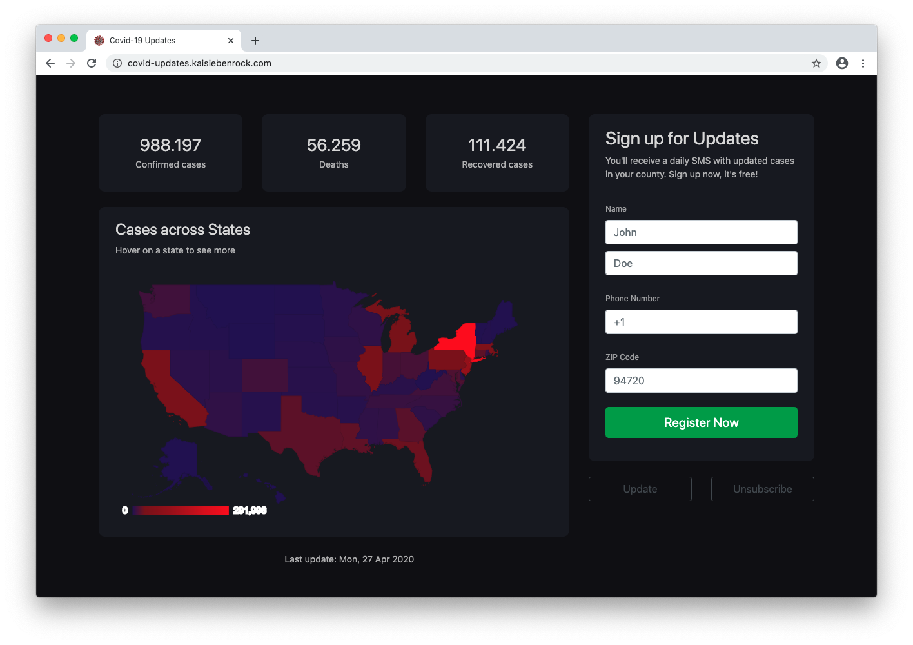
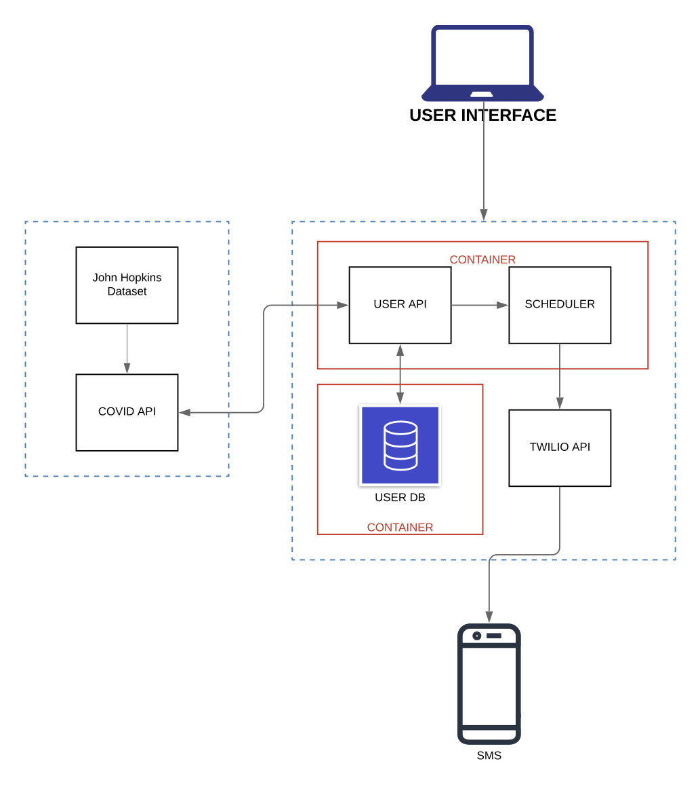

# COVID-19 API

Given a user’s location, our service will return the updated number of COVID-19 cases in their county.  A user can enter their name, phone number, and zipcode to sign up. Once subscribed, they will receive a daily text message with updated statistics. Additionally, other services and applications can call our covid API in the case that they want to retrieve the most recent covid-19 data on a county basis!




## Why We Built It

Given the current situation with COVID-19, we decided to explore the possibility of implementing an API that will deliver useful information to any person interested in knowing more about the virus.
For this reason, we worked on an API that will get the most recent COVID-19 confirmed/deaths/recovered cases and delivered this information based on user location.


## System Architecture



## Getting Started

These instructions will get you a copy of the project up and running on your local machine for development and testing purposes. See deployment for notes on how to deploy the project on a live system.


### Prerequisites

For you to run this API the following dependencies should be installed:

* flask
* flask_restful
* mysqlclient
* requests
* uszipcode
* twilio
* apscheduler

Apart from this python libraries, it is important to have docker installed.

*Note:* for Windows users please install docker toolbox.


### Installing

To start a local working version of this project, follow the next steps:

In your CMD run

```
docker network create <name-of-network>
```

inside the user-endpoints directory run. The command bellow assumes the existence of Dockerfile.

```
docker build -t <image name> .
```

To start the docker container "image name" run:

```
docker run  -dit --name=<container name> --network <name-of-network> -e FLASK_APP=UserBackend.py -p 5000:5000 <image-name>
```
Then install the following MySQL image:

```
docker run --name <name-of-db-container> -e MYSQL_ROOT_PASSWORD=<password> -e MYSQL_DATABASE=<name of database> -v path/to/db://db --network <name-of-network> -dit mysql:latest --default-authentication-plugin=mysql_native_password
```
The above command will:

1. Download MySQL image
2. Create a new database with credentials passwod.
3. Start the container with name: name-of-db-container

For more useful commands please check the setup.sh inside user-endpoints directory.

*Note:* Run the following commands to create the table inside the database:

```
# Let's now tell docker to execute a command (bash) in the database-container container and make it interactive so that we can run commands inside the database-container container in another process (i.e. don't stop the mysql process within the docker container)
docker exec -it user-db-container bash

# Now we are inside the mysql container in a separate process. Let's run the mysql client app so that we can execute SQL queries
mysql -uroot -p

# Let's select the demo database we created on initialization
use <name of database>;

# create table
CREATE TABLE users (
    id int unsigned not null auto_increment primary key,
    name VARCHAR(100) NOT NULL,
    surname VARCHAR(100) NOT NULL,
    phone VARCHAR(30) NOT NULL,
    zipcode VARCHAR(30) NOT NULL
);
```


## Running Tests

To run tests for the userserver endpoints (this endpoints register new user and send messages via Twilio) run:

```
# run this inside user-endpoints directory
python tests.py
```


## Built With

* [Flask](https://flask.palletsprojects.com/en/1.1.x/) - Micro web framework for APIs
* [Twilio](https://www.twilio.com) - Cloud communications platform for SMS
* [Docker](https://www.docker.com/) - Virtualization
* [MySQL](https://www.mysql.com/) - Relational database management system
* [CSSEGISandData](https://github.com/CSSEGISandData/COVID-19) - Covid data source
