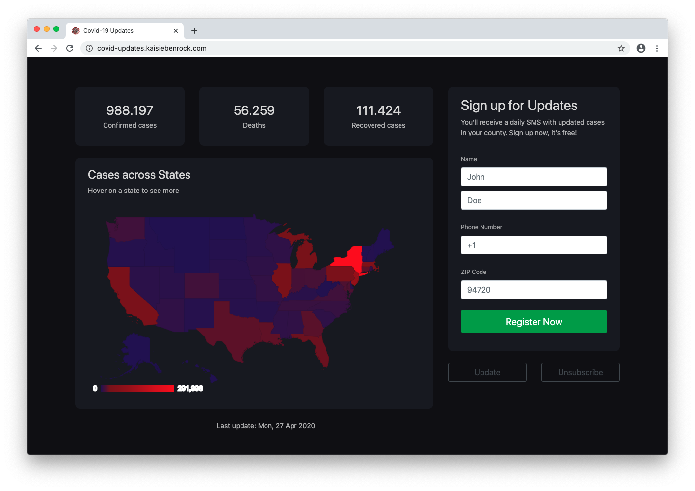
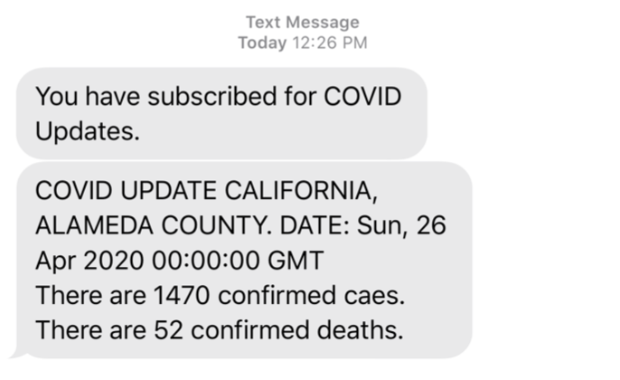
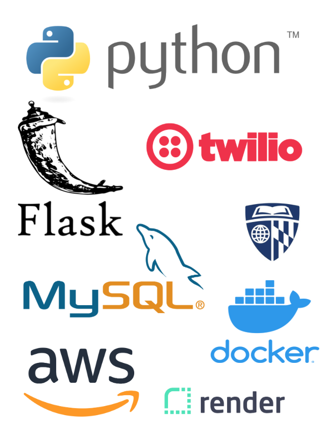

# COVID-19 API

Given a user’s location, our service will return the updated number of COVID-19 cases in their county.  A user can enter their name, phone number, and zip code to sign up. Once subscribed, they will receive a daily text message with updated statistics. Additionally, other services and applications can call our Covid-19 API in the case that they want to retrieve the most recent Covid-19 data on a county basis!






## Why We Built It

Given the current situation with COVID-19, we decided to explore the possibility of implementing an API that will deliver useful information to any person interested in knowing more about the virus.
For this reason, we worked on an API that will get the most recent COVID-19 confirmed/deaths/recovered cases and delivered this information based on user location.


## System Architecture


## APIs

### Covid-19 Data API

The data API retrieves the current case numbers. The data is available in a repository by Johns Hopkins CSSE on [Github](https://github.com/CSSEGISandData/COVID-19) as a *.csv* file. Our script automatically retrieves the newest daily report file available and converts it to a pandas data frame while parsing time and dates. All states and counties are encoded to align with the User API. Additionally, we save a *.csv* copy of the cleaned data frame.

Depending on the user's request parameters, the API can return the total for the U.S., for a specific state, or a specific county. The response also include the date of the last update.

A dedicated states API returns the sum of cases for each state. This data is then shown on the geo chart on the user signup website.


#### Update data

    * URL: /update
    * Method: GET
    * Success: "Data updated", 200
    * Error: "Error retrieving file from GitHub", 400
    * Error: "Error while handling df", 400


#### Check last update

    * URL: /last_update
    * Method: GET
    * Success: [Date of last update], 200
    * Error: "No data", 400


#### Get data for specific state (and county)

    * URL: /get
    * Method: GET
    * Params: state=<state>&county=<county>
    * Success: {Confirmed, Deaths, Recovered}, 200
    * Error: "No data", 400


#### Get data for all states

    * URL: /states
    * Method: GET
    * Success: {state: {Confirmed, Deaths, Recovered}}, 200
    * Error: "No data", 400


### User API

The goal of user API represented in the diagram above is to contain the endpoints necessary to:

#### Register a new user

    * URL: /users/:id
    * Method: GET, POST
    * Params: first_name=<name>&last_name=<last>&phone=<phone>zipcode=<zipcode>
    * Success: 200
    * Error: "error: couldn't register user", 400


#### Update user information

    * URL: /update
    * Method: POST
    * Params: first_name=<name>&last_name=<lastname>&last_phone=<+555555555>&new_phone=<+0000000000>&zipcode=<code>
    * Success: 200
    * Error: "error: user doesn't exist", 400


#### Unsubscribe a user

    * URL: /unsubscribe
    * Method: POST
    * Params: phone=<phone>
    * Success: 200
    * Error: "error: user doesn't exist", 404


## Deployment

- The Covid data API was deployed to Render as web service in its own docker container; it can be found at https://covid-api.onrender.com
- We used an AWS - EC2 (Ubuntu OS) Instance to deploy the User API which can be accessed at http://3.12.83.161:5000/


## Getting Started

These instructions will get you a copy of the project up and running on your local machine for development and testing purposes. See deployment for notes on how to deploy the project on a live system.


### Prerequisites

For you to run this API the following dependencies should be installed:

* flask
* flask_restful
* mysqlclient
* requests
* pandas
* uszipcode
* twilio
* apscheduler

Apart from these Python libraries, it is important to have Docker installed.

*Note:* for Windows users please install Docker toolbox.


### Installing

To start a local working version of this project, follow the next steps:

In your CMD run

```
docker network create <name-of-network>
```

Inside the user-endpoints directory run the command bellow assumes the existence of Dockerfile.

```
docker build -t <image name> .
```

To start the docker container "image name" run:

```
docker run  -dit --name=<container name> --network <name-of-network> -e FLASK_APP=UserBackend.py -p 5000:5000 <image-name>
```
Then install the following MySQL image:

```
docker run --name <name-of-db-container> -e MYSQL_ROOT_PASSWORD=<password> -e MYSQL_DATABASE=<name of database> -v path/to/db://db --network <name-of-network> -dit mysql:latest --default-authentication-plugin=mysql_native_password
```
The above command will:

1. Download MySQL image
2. Create a new database with credentials password.
3. Start the container with name: name-of-db-container

For more useful commands, please check the setup.sh inside user-endpoints directory.

*Note:* Run the following commands to create the table inside the database:

```
# Let's now tell docker to execute a command (bash) in the database-container container and make it interactive so that we can run commands inside the database-container container in another process (i.e. don't stop the mysql process within the docker container)
docker exec -it user-db-container bash

# Now we are inside the mysql container in a separate process. Let's run the mysql client app so that we can execute SQL queries
mysql -uroot -p

# Let's select the demo database we created on initialization
use <name of database>;

# create table
CREATE TABLE users (
    id int unsigned not null auto_increment primary key,
    name VARCHAR(100) NOT NULL,
    surname VARCHAR(100) NOT NULL,
    phone VARCHAR(30) NOT NULL,
    zipcode VARCHAR(30) NOT NULL
);
```


## Running Tests

To run tests for the user server endpoints which register new users and send messages via Twilio:

```
# run this inside user-endpoints directory
python tests.py
```


## Built With



* [Flask](https://flask.palletsprojects.com/en/1.1.x/) - Micro web framework for APIs
* [Twilio](https://www.twilio.com) - Cloud communications platform for SMS
* [Docker](https://www.docker.com/) - Virtualization
* [MySQL](https://www.mysql.com/) - Relational database management system
* [CSSEGISandData](https://github.com/CSSEGISandData/COVID-19) - Covid-19 data source
